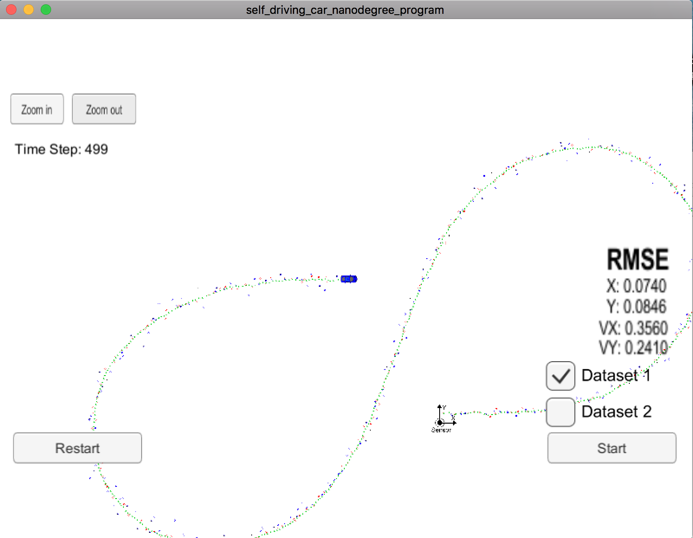
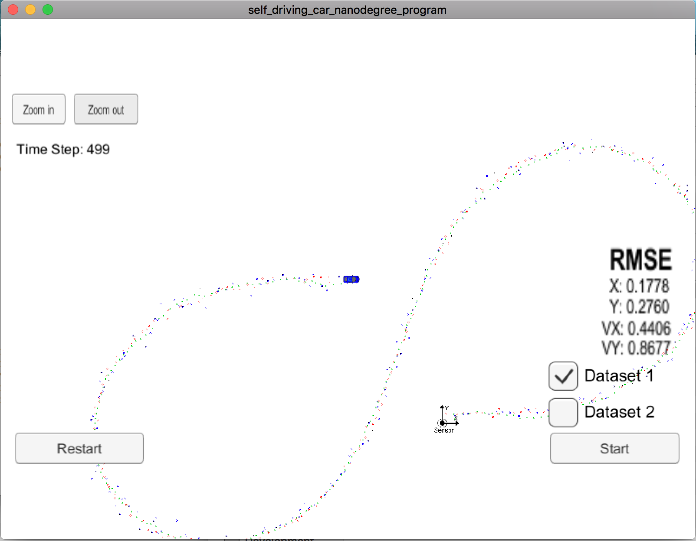
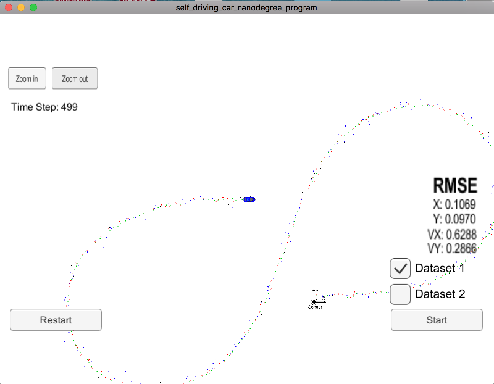
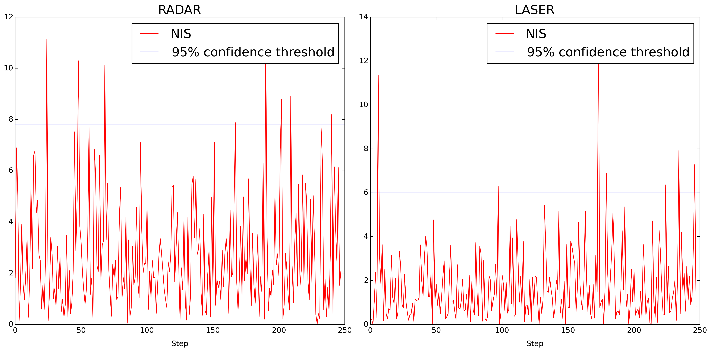

# Unscented Kalman Filter Project
This project implements an Unscented Kalman Filter (UKF) for the Self-Driving Car Engineer Nanodegree Program, December 10, 2017.

The code in the project uses a UKF to estimate the state of a simulated vehicle in the [Udacity term2 simulator](https://github.com/udacity/self-driving-car-sim/releases). The vehicle drives in what looks like a figure-8 pattern. Measurements are provided via radar (range, heading angle, and range rate) and Lidar (direct position meaasurements).

The code in the project is in the src subfolder. To build the project on a different machine, perform the following steps:

1. cd build
2. rm -rf build
3. rmdir build
4. mkdir build
5. cd build
6. cmake ..
7. make
8. ./UnscentedKF

Note that when running UnscentedKF, radar and lidar measurements are enabled by default. The user can run with just radar using:

./UnscentedKF false

which turns off lidar. To run with just lidar (turn off radar), run the code like this:

./UnscentedKF true false

This project uses the CTRV process model as the system dynamics. This is a nonlinear model with 5 state variables: x position, y position, speed, heading (yaw) angle, and yaw rate. The UKF creates a set of sigma points which are distributed around the existing estimate, propagates these points forward in time using the state prediction equations, computes mean and covariance estimates based on the propagates sigma points, and then uses sensor measurements to update the state estimates based on deviations from the mean predicted estimates.

To test the performance, one can use the Udacity term2 simulator. The results are shown as follows:

BOTH SENSORS:    

RADAR ONLY:      

LIDAR ONLY:         

Note that when using both sensors, the RMSE's are:    
X: 0.074    
Y: 0.0846    
VX: 0.3560    
VY: 0.2410    

When using only radar, the values are:     
X: 0.1778    
Y: 0.2760    
VX: 0.4406    
VY: 0.8677    

which as expected is not quite as good as when using both sensors, but is still pretty good. 

When using Lidar only, the results are:    
X: 0.1069    
Y: 0.0970    
VX: 0.6288    
VY: 0.2866    

which again as expected is slightly worse than when using both sensors, but is also still pretty good.

Finally, a key part of the project was to check the NIS statistic and use that to adjust the process noise values. The NIS should follow a chi-squared distribution with the vast majority of points falling below the 95% confidence level, which for radar (3 degrees of freedom) is 7.82. To check this I wrote the script plotnis.py. Running this shows that the NIS values have the following distribution:

python plotnis.py     
Fraction between 0.0 and 0.35 = 0.0725806451613     
Fraction between 0.35 and 7.82 = 0.895161290323     
Fraction above 7.82 = 0.0322580645161     

Note that 89.5% of points are between 0.35 and 7.82 as expected. This validates that my choices for process noise (in ukf.cpp) were reasonable:

  // Process noise standard deviation longitudinal acceleration in m/s^2
  std_a_ = 3;

  // Process noise standard deviation yaw acceleration in rad/s^2
  std_yawdd_ = 0.5;

Below is a plot of the NIS for both radar and lidar sensors.

